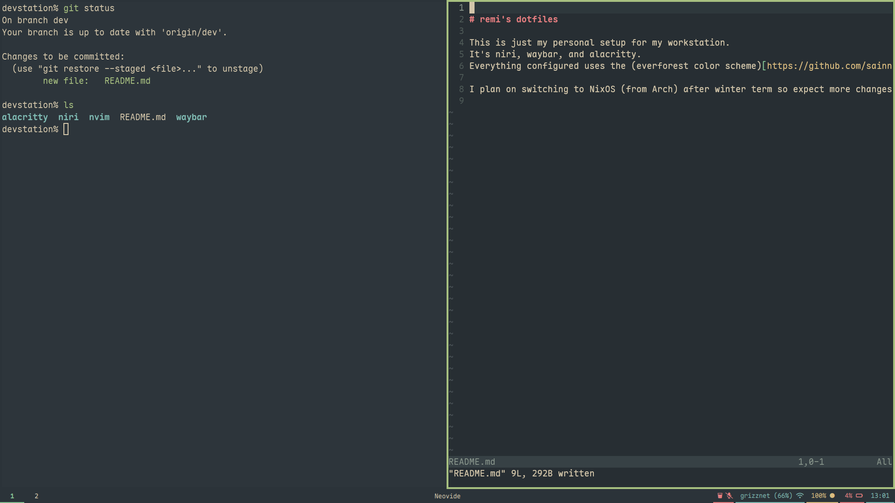

# remi's dotfiles

This is just my personal setup for my workstation.
It's niri, waybar, and alacritty.
Everything configured uses the (everforest color scheme)[https://github.com/sainnhe/everforest].

I plan on switching to NixOS (from Arch) after winter term so expect more changes then.

